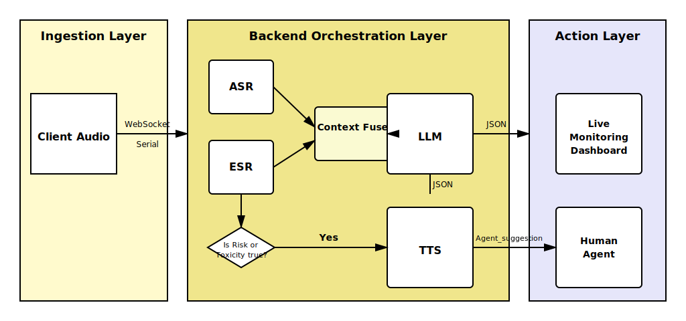

# Vertical QA — AI-Powered Real-Time Call Center Quality Monitoring

**Version 1.0.0**

An intelligent call center monitoring system that provides real-time conversation analysis, emotion detection, escalation risk assessment, and agent coaching through multimodal AI processing.



## Table of Contents

- [Overview](#overview)
- [Key Features](#key-features)
- [System Architecture](#system-architecture)
- [Technical Specifications](#technical-specifications)
  - [ASR (Automatic Speech Recognition)](#asr-automatic-speech-recognition)
  - [SER (Speech Emotion Recognition)](#ser-speech-emotion-recognition)
  - [Context Fusion](#context-fusion)
  - [LLM Evaluation](#llm-evaluation)
  - [Escalation Algorithm](#escalation-algorithm)
- [Output Parameters](#output-parameters)
- [Installation](#installation)
- [Configuration](#configuration)
- [API Documentation](#api-documentation)
- [Deployment](#deployment)
- [Troubleshooting](#troubleshooting)

---

## Overview

Vertical QA is a real-time AI monitoring system designed for call centers that combines speech recognition, emotion analysis, and large language models to provide instant insights into customer-agent conversations. The system detects escalation risks, toxic behavior, customer intent, and provides real-time coaching suggestions to agents.

Built on a modern tech stack:
- **Backend**: Python FastAPI with WebSocket support
- **Frontend**: React + TypeScript + Vite
- **AI Services**: SoniaX (ASR), OpenRouter (LLM), SpeechBrain (SER), gTTS (TTS)

---

## Key Features

✅ **Real-Time Transcription** — Live speech-to-text with SoniaX ASR streaming  
✅ **Emotion Detection** — Voice emotion analysis using SpeechBrain ECAPA-TDNN  
✅ **Intent Classification** — 10 intent categories from general queries to legal threats  
✅ **Sentiment Analysis** — Positive, neutral, negative sentiment detection  
✅ **Toxicity Detection** — Automatic flagging of abusive language and compliance violations  
✅ **Escalation Risk Scoring** — Deterministic algorithm combining intent severity and emotional urgency  
✅ **Agent Coaching** — Real-time suggestions delivered via text and optional TTS audio  
✅ **Supervisor Dashboard** — Live monitoring of all active calls with risk indicators  
✅ **Multi-Model LLM Support** — OpenRouter integration (Claude, GPT-4, Llama, etc.)

---

## System Architecture

### Data Flow Pipeline

```
┌─────────────────────────────────────────────────────────────────┐
│  FRONTEND (React + WebSocket)                                   │
│  • Customer Interface  • Agent Interface  • Supervisor Dashboard│
└────────────────────────┬────────────────────────────────────────┘
                         │ WebSocket (bidirectional)
                         │ Audio chunks (base64, 16kHz PCM)
                         ▼
┌─────────────────────────────────────────────────────────────────┐
│  INGESTION LAYER (websocket.py)                                 │
│  • Validate audio chunks                                        │
│  • Route by role (customer/agent)                               │
│  • Start pipeline timer                                         │
└────────────────────────┬────────────────────────────────────────┘
                         │
                    asyncio.gather() — CONCURRENT FORK
                ┌────────┴────────┐
                │                 │
                ▼                 ▼
    ┌───────────────────┐   ┌──────────────────────────┐
    │  ASR SERVICE      │   │  ACOUSTIC SERVICE        │
    │  (SoniaX)         │   │  (SpeechBrain SER)       │
    │  • Stream audio   │   │  • Emotion detection     │
    │  • Poll sentences │   │  • Vocal tension         │
    └─────────┬─────────┘   └──────────┬───────────────┘
              │                        │
              │  Transcript            │  Voice Emotion +
              │  + Confidence          │  Vocal Tension
              └────────┬───────────────┘
                       ▼
            ┌──────────────────────────┐
            │  SESSION MANAGER         │
            │  • Append turn to        │
            │    full_transcript       │
            │  • Update acoustic state │
            └──────────┬───────────────┘
                       ▼
            ┌──────────────────────────┐
            │  CONTEXT FUSER           │
            │  • Build full call       │
            │    history context       │
            │  • Acoustic summary      │
            └──────────┬───────────────┘
                       ▼
            ┌──────────────────────────┐
            │  LLM EVALUATION          │
            │  (OpenRouter)            │
            │  • Intent classification │
            │  • Sentiment analysis    │
            │  • Toxicity detection    │
            │  • Agent suggestions     │
            └──────────┬───────────────┘
                       ▼
            ┌──────────────────────────┐
            │  ESCALATION CALCULATOR   │
            │  (Deterministic)         │
            │  • Risk scoring          │
            │  • Threshold mapping     │
            └──────────┬───────────────┘
                       ▼
            ┌──────────────────────────┐
            │  CONDITIONAL TTS         │
            │  (gTTS)                  │
            │  • High risk whispers    │
            │  • Toxic event alerts    │
            └──────────┬───────────────┘
                       ▼
            ┌──────────────────────────┐
            │  BROADCAST TO DASHBOARD  │
            │  • Real-time updates     │
            │  • Telemetry metrics     │
            │  • Agent whispers        │
            └──────────────────────────┘
```

### Core Backend Flow

The backend implements a **two-speed streaming pipeline**:

**FAST PATH** (~32ms cadence):
- Audio chunk arrives → decode base64 → amplify 8× → stream to SoniaX (fire-and-forget)
- SER analyzes audio in parallel via ProcessPoolExecutor

**ANALYSIS TRIGGER** (~2-5s cadence, on sentence boundary):
- SoniaX detects sentence completion → assembles full sentence
- Pipeline triggers: Context Fusion → LLM Evaluation → Escalation Calculation → Broadcast

---

## Technical Specifications

### ASR (Automatic Speech Recognition)

**Provider**: SoniaX  
**Model**: stt-rt-preview (streaming real-time model)  
**Audio Format**: 16kHz PCM mono, base64-encoded  
**Language**: English (configurable)

**Implementation Details**:
- One long-lived WebSocket per (session_id, role) pair
- Audio amplification: 8× gain for improved recognition
- Sentence detection: 100ms gap between tokens triggers sentence boundary
- Non-blocking queue: Completed sentences queued for pipeline processing

**Key Parameters**:
- `ASR_SAMPLE_RATE`: 16000 Hz
- `ASR_CONFIDENCE_GATE`: 0.40 (below this threshold, escalation scores are dampened by 30%)
- `ASR_DAMPEN_FACTOR`: 0.70
- `AUDIO_GAIN`: 8 (amplification multiplier)
- `SENTENCE_GAP_S`: 0.10 (sentence boundary detection)

**Output**:
- `transcript_segment`: Completed sentence text
- `confidence`: Float 0.0–1.0 (fixed at 0.90 for SoniaX)
- `is_final`: Boolean indicating sentence completion

---

### SER (Speech Emotion Recognition)

**Provider**: SpeechBrain  
**Model**: ECAPA-TDNN (wav2vec2-IEMOCAP)  
**Execution**: ProcessPoolExecutor (CPU-isolated to avoid blocking async event loop)

**Features Extracted**:

| Feature Group | Features | Call Center Signal |
|---|---|---|
| **Prosodic** | Pitch (F0), Intensity (RMS), Speech Rate | Anger, Panic, Confusion |
| **Spectral** | MFCCs (13 coefficients), Jitter, Shimmer | Vocal Tension, Distress |
| **Temporal** | Silence Ratio, Interruption Detection | Dead air, Frustration |
| **Emotion** | Anger, Sadness, Neutral, Fear, Disgust, Happiness | Direct emotion label |

**Voice Emotion Classes** (6 categories):

| Emotion | Urgency Score | Description |
|---|---|---|
| `happiness` | 0.00 | Positive, satisfied customer |
| `neutral` | 0.40 | Calm, baseline emotional state |
| `sadness` | 0.50 | Disappointed, resigned |
| `fear` | 0.65 | Anxious, worried |
| `disgust` | 0.75 | Frustrated, irritated |
| `anger` | 1.00 | Hostile, aggressive |

**Vocal Tension Levels** (3 categories):
- `low`: Calm voice (RMS ≤ 0.15, no pitch spike)
- `medium`: Elevated RMS OR pitch spike detected
- `high`: High RMS (> 0.15) + pitch spike (> 250Hz) + high zero-crossing rate

**Vocal Tension Calculation**:
```python
score = sum([rms > 0.15, zcr > 0.15, pitch_spike])
if score >= 2: return "high"
if score == 1: return "medium"
return "low"
```

**Key Parameters**:
- `SER_MODEL_SOURCE`: "speechbrain/emotion-recognition-wav2vec2-IEMOCAP"
- `SER_CHUNK_DURATION_S`: 2.0 seconds
- `SER_CUSTOMER_SKEW`: 0.80 (weight customer acoustics vs agent)

**Fallback Mode**: When SpeechBrain is unavailable, uses weighted mock with realistic emotion distributions:
- Customer: 30% anger, 30% neutral, 15% sadness, 10% fear, 10% disgust, 5% happiness
- Agent: 70% neutral, 20% happiness, 5% sadness, 3% fear, 1% disgust, 1% anger

---

### Context Fusion

**Module**: `context_fuser.py`  
**Purpose**: Combines full conversation history with acoustic state for LLM evaluation

**Key Design Decision**: The system passes the **FULL call history** to the LLM (not just a sliding window), allowing the LLM to see the complete conversation arc from call start.

**Session Manager Architecture**:
- `full_transcript`: List of ALL turns from call start → passed to LLM
- `acoustic_window`: Bounded deque of last N turns → for acoustic state tracking only
- Thread-safe via asyncio.Lock per session

**Key Parameters**:
- `WINDOW_SIZE`: 10 turns (for acoustic window only)
- `ACOUSTIC_WEIGHT_DECAY`: 0.85 per turn (emotion scores fade over time)
- `SILENCE_THRESHOLD_MS`: 3000ms (flag dead-air gaps > 3 seconds)
- `INTERRUPTION_OVERLAP_MS`: 500ms (cross-talk detection sensitivity)

**Output**: `FusedContext` object containing:
- `conversation_window`: Full conversation history with role, text, and voice_emotion
- `acoustic_summary`: Latest voice_emotion and vocal_tension
- `asr_confidence`: Current ASR confidence score

---

### LLM Evaluation

**Provider**: OpenRouter  
**Default Model**: Claude Sonnet 4.5 (configurable to GPT-4, Llama, etc.)  
**Temperature**: 0.0 (deterministic for consistent JSON output)  
**Max Tokens**: 512

**Input**: Full conversation history + acoustic summary from Context Fuser

**System Prompt Strategy**:
- Enforces strict JSON output schema (no markdown, no explanation)
- Analyzes FULL call transcript (all turns from call start)
- Bases intent on customer's primary goal
- Bases sentiment on both text content AND voice_emotion
- Toxicity flag only for abusive language or explicit threats

**Output**: LLM evaluates ONLY the following (escalation risk is computed separately):
- `intent`: Customer's primary goal (10 categories)
- `sentiment`: Overall conversation sentiment (3 categories)
- `toxicity_flag`: Boolean indicating abusive language or threats
- `compliance_flags`: Array of violation types (only when toxicity_flag = true)
- `agent_suggestion`: Actionable coaching (max 20 words)

**Intent Categories** (10 classes with severity scores):

| Intent | Severity Score | Description |
|---|---|---|
| `general_query` | 0.10 | General information / FAQ |
| `billing_query` | 0.30 | Non-dispute billing question |
| `technical_support` | 0.40 | Product/service not working |
| `complaint_service` | 0.55 | Dissatisfied with service quality |
| `complaint_product` | 0.55 | Dissatisfied with product |
| `refund_request` | 0.65 | Requesting money back |
| `cancellation_request` | 0.85 | Wants to cancel service/subscription |
| `account_closure` | 0.90 | Full account termination |
| `supervisor_escalation_request` | 1.00 | Explicitly requests supervisor |
| `legal_or_regulatory_threat` | 1.00 | Mentions lawyer, lawsuit, court |

**Sentiment Categories** (3 classes):

| Sentiment | Definition |
|---|---|
| `positive` | Customer is satisfied, happy, or expressing gratitude |
| `neutral` | Customer is calm, matter-of-fact, no strong emotion |
| `negative` | Customer is dissatisfied, frustrated, or upset |

**Sentiment Logic**: LLM analyzes both transcript text AND voice_emotion to determine sentiment. A mismatch between text and voice (e.g., "I'm fine" with angry voice) is a critical escalation signal.

**Toxicity Flag** (Boolean):

| Value | Definition |
|---|---|
| `true` | Abusive language, profanity, personal insults, explicit threats detected |
| `false` | No toxic behavior detected |

**Compliance Flags** (6 types, only populated when toxicity_flag = true):

| Flag | Trigger Condition |
|---|---|
| `abusive_language` | Profanity or personal insults |
| `fraud_accusation` | Customer accuses agent of stealing/fraud |
| `legal_threat` | Mentions lawyer, lawsuit, court |
| `personal_information_breach` | Agent inadvertently exposed PII |
| `policy_violation` | Agent offered unauthorized discounts |
| `harassment` | Repeated hostile calls from same user |

**Error Handling**:
- 3 retry attempts with exponential backoff (1s, 2s, 4s)
- Transient errors (connection, timeout, rate limit) trigger retry
- JSON parsing errors fall back to safe defaults
- Fallback response: general_query, neutral sentiment, no toxicity

**Mock Mode**: When OpenRouter API key is not set, uses weighted scenarios matching voice emotions for testing.

---

### Escalation Algorithm

**CRITICAL**: Escalation risk is computed **deterministically** by the backend algorithm, NOT by the LLM. This ensures consistent, auditable risk scoring.

**Module**: `context_fuser.compute_escalation_risk()`

**4-Step Algorithm**:

#### Step 1: Unconditional Override Check

```python
if toxicity_flag == True:
    return "high", 1.0

if intent in ["supervisor_escalation_request", "legal_or_regulatory_threat"]:
    return "high", 1.0
```

If toxicity is detected OR customer explicitly requests escalation/legal action, immediately return HIGH risk with score 1.0.

#### Step 2: Weighted Baseline Calculation

Formula:

```
Raw Score = (0.65 × Intent Severity) + (0.35 × Emotion Urgency)
```

Where:
- **Intent Severity**: From intent severity table (0.10 to 1.00)
- **Emotion Urgency**: From voice emotion urgency table (0.00 to 1.00)
- **Weights**: 65% intent, 35% emotion (based on ITIL severity-urgency decomposition)

**Maximum possible score**: (0.65 × 1.0) + (0.35 × 1.0) = **1.00**

#### Step 3: ASR Confidence Gate

```python
if asr_confidence < 0.40:
    raw_score = raw_score * 0.70  # 30% dampening
```

If ASR confidence is below 40%, the system assumes noisy audio and reduces the escalation score by 30% to prevent false alarms from hallucinated transcripts.

#### Step 4: Threshold Matrix

| Raw Score Range | Escalation Risk Label |
|---|---|
| < 0.50 | `low` |
| 0.50 – 0.74 | `medium` |
| ≥ 0.75 | `high` |

**Key Parameters**:
- `INTENT_WEIGHT`: 0.65
- `SEMANTIC_WEIGHT`: 0.35
- `ESCALATION_LOW_THRESHOLD`: 0.50
- `ESCALATION_HIGH_THRESHOLD`: 0.75

**Example Calculations**:

**Example 1: Angry customer asking about store hours**
- Intent: `general_query` (0.10)
- Voice Emotion: `anger` (1.00)
- Calculation: (0.65 × 0.10) + (0.35 × 1.00) = 0.065 + 0.35 = **0.415**
- Result: **LOW** risk ✅ (prevents emotion-based queue manipulation)

**Example 2: Calm customer canceling account**
- Intent: `cancellation_request` (0.85)
- Voice Emotion: `neutral` (0.40)
- Calculation: (0.65 × 0.85) + (0.35 × 0.40) = 0.5525 + 0.14 = **0.692**
- Result: **MEDIUM** risk ✅ (churn risk detected despite calm voice)

**Example 3: Angry customer closing account**
- Intent: `account_closure` (0.90)
- Voice Emotion: `anger` (1.00)
- Calculation: (0.65 × 0.90) + (0.35 × 1.00) = 0.585 + 0.35 = **0.935**
- Result: **HIGH** risk ✅ (dual-signal alignment)

**Example 4: Toxic refund request**
- Intent: `refund_request` (0.65)
- Voice Emotion: `anger` (1.00)
- Toxicity: `true`
- Result: **HIGH** risk (override activated) ✅

**Example 5: Noisy audio with hallucinated legal threat**
- Intent: `legal_or_regulatory_threat` (1.00)
- ASR Confidence: 0.28 (below 0.40 gate)
- Result: Override dampened → **MEDIUM** risk ✅ (false alarm blocked)

---

## Output Parameters

### WebSocket Message Format

The system broadcasts real-time updates to all connected clients via WebSocket. Two message types are sent:

#### 1. Standard Update Message (Normal Conversation)

```json
{
  "type": "update",
  "session_id": "session_123",
  "role": "customer",
  "transcript": "I just want to know why my bill is higher this month.",
  "voice_emotion": "neutral",
  "vocal_tension": "medium",
  "evaluation": {
    "intent": "billing_query",
    "sentiment": "neutral",
    "toxicity_flag": false,
    "escalation_risk": "low",
    "escalation_score": 0.31,
    "agent_suggestion": "Calmly explain the billing cycle and recent charges."
  },
  "metrics": {
    "total_latency_ms": 118,
    "throughput_kbps": 256.0,
    "asr_confidence": 0.90
  }
}
```

#### 2. Agent Whisper Message (High Risk / Toxic Event)

Sent ONLY to the agent's WebSocket connection when escalation risk is HIGH or toxicity is detected:

```json
{
  "type": "agent_whisper",
  "session_id": "session_123",
  "trigger": "high_risk_and_toxicity",
  "escalation_risk": "high",
  "toxicity_flag": true,
  "agent_suggestion": "Stay calm. Do not match hostility. Transfer call to supervisor immediately.",
  "tts_audio": "<base64_encoded_mp3>"
}
```

**Note**: When `toxicity_flag = true`, the `compliance_flags` array is populated in the evaluation block:

```json
{
  "evaluation": {
    "intent": "legal_or_regulatory_threat",
    "sentiment": "negative",
    "toxicity_flag": true,
    "compliance_flags": ["abusive_language", "legal_threat"],
    "escalation_risk": "high",
    "escalation_score": 1.0,
    "agent_suggestion": "Stay calm. Transfer to supervisor immediately."
  }
}
```

### Complete Parameter Reference

| Parameter | Type | Source | Description |
|---|---|---|---|
| `type` | string | System | Message type: "update" or "agent_whisper" |
| `session_id` | string | System | Unique session identifier |
| `role` | string | System | "customer" or "agent" |
| `transcript` | string | ASR | Completed sentence from SoniaX |
| `voice_emotion` | string | SER | Emotion label from SpeechBrain (6 classes) |
| `vocal_tension` | string | SER | Tension level: "low", "medium", "high" |
| `evaluation.intent` | string | LLM | Customer intent (10 classes) |
| `evaluation.sentiment` | string | LLM | Sentiment: "positive", "neutral", "negative" |
| `evaluation.toxicity_flag` | boolean | LLM | True if abusive language detected |
| `evaluation.compliance_flags` | array | LLM | Violation types (only when toxicity_flag = true) |
| `evaluation.escalation_risk` | string | Algorithm | Risk level: "low", "medium", "high" |
| `evaluation.escalation_score` | float | Algorithm | Numeric score 0.0–1.0 |
| `evaluation.agent_suggestion` | string | LLM | Actionable coaching (max 20 words) |
| `metrics.total_latency_ms` | float | Telemetry | End-to-end processing latency |
| `metrics.throughput_kbps` | float | Telemetry | Audio throughput in kbps |
| `metrics.asr_confidence` | float | ASR | ASR confidence 0.0–1.0 (fixed at 0.90 for SoniaX) |
| `tts_audio` | string | TTS | Base64-encoded MP3 (only in agent_whisper) |
| `trigger` | string | System | Whisper trigger: "high_risk", "toxicity", "high_risk_and_toxicity" |

---


## Installation

### Prerequisites

- **Python**: 3.9 or higher
- **Node.js**: 18.x or higher
- **npm** or **yarn**: Latest version

### Backend Setup

1. Navigate to the backend directory:
```bash
cd vertical-qa/backend
```

2. Create a virtual environment:
```bash
python -m venv venv
source venv/bin/activate  # On Windows: venv\Scripts\activate
```

3. Install dependencies:
```bash
pip install -r requirements.txt
```

4. Create `.env` file from template:
```bash
cp ../.env.example .env
```

5. Configure your API keys in `.env`:
```env
SONIAX_API_KEY=your_soniax_key_here
OPENROUTER_API_KEY=your_openrouter_key_here
```

6. Start the backend server:
```bash
uvicorn app.main:app --host 0.0.0.0 --port 8000 --reload
```

The backend will be available at `http://localhost:8000`

### Frontend Setup

1. Navigate to the frontend directory:
```bash
cd vertical-qa/frontend
```

2. Install dependencies:
```bash
npm install
# or
yarn install
```

3. Start the development server:
```bash
npm run dev
# or
yarn dev
```

The frontend will be available at `http://localhost:5173`

---

## Configuration

### Environment Variables

All configuration is managed through environment variables. Copy `.env.example` to `.env` and configure:

#### Required API Keys

```env
# SoniaX ASR
SONIAX_API_KEY=your_soniax_api_key

# OpenRouter LLM (supports multiple models)
OPENROUTER_API_KEY=your_openrouter_api_key
OPENROUTER_BASE_URL=https://openrouter.ai/api/v1
```

#### LLM Configuration

```env
# Model selection (OpenRouter supports multiple providers)
LLM_MODEL=anthropic/claude-sonnet-4-5
# Alternatives:
# LLM_MODEL=openai/gpt-4-turbo
# LLM_MODEL=meta-llama/llama-3-70b-instruct
# LLM_MODEL=google/gemini-pro

LLM_TEMPERATURE=0.0        # Deterministic output (0.0 recommended)
LLM_MAX_TOKENS=512         # Max response length
```

#### ASR Configuration

```env
ASR_SAMPLE_RATE=16000      # Audio sample rate (Hz)
ASR_LANGUAGE=en            # Language code
ASR_CONFIDENCE_GATE=0.40   # Confidence threshold for dampening
ASR_DAMPEN_FACTOR=0.70     # Dampening multiplier for low confidence
```

#### SER Configuration

```env
SER_MODEL_SOURCE=speechbrain/emotion-recognition-wav2vec2-IEMOCAP
SER_CHUNK_DURATION_S=2.0   # Audio chunk duration for analysis
SER_CUSTOMER_SKEW=0.80     # Weight customer vs agent acoustics
```

#### Escalation Algorithm Tuning

```env
# Weights (must sum to 1.0)
INTENT_WEIGHT=0.65         # Weight for intent severity
SEMANTIC_WEIGHT=0.35       # Weight for emotion urgency

# Thresholds
ESCALATION_LOW_THRESHOLD=0.50    # Below this = LOW risk
ESCALATION_HIGH_THRESHOLD=0.75   # Above this = HIGH risk
```

#### Context Fusion Parameters

```env
WINDOW_SIZE=10                    # Rolling conversation turns (acoustic window)
ACOUSTIC_WEIGHT_DECAY=0.85        # Emotion fade per turn
SILENCE_THRESHOLD_MS=3000         # Dead air detection (ms)
INTERRUPTION_OVERLAP_MS=500       # Cross-talk sensitivity (ms)
```

### Tuning the Escalation Algorithm

The escalation algorithm can be fine-tuned by adjusting weights and thresholds:

**To prioritize intent over emotion**:
```env
INTENT_WEIGHT=0.75
SEMANTIC_WEIGHT=0.25
```

**To make the system more sensitive (more HIGH risk alerts)**:
```env
ESCALATION_HIGH_THRESHOLD=0.65   # Lower threshold = more HIGH alerts
```

**To make the system less sensitive (fewer false alarms)**:
```env
ESCALATION_LOW_THRESHOLD=0.60    # Higher threshold = fewer LOW alerts
ESCALATION_HIGH_THRESHOLD=0.85   # Higher threshold = fewer HIGH alerts
```

---

## API Documentation

### WebSocket Endpoint

**URL**: `ws://localhost:8000/ws/{session_id}`

The WebSocket connection handles bidirectional real-time communication between frontend and backend.

### Message Types

#### 1. Session Start (Frontend → Backend)

```json
{
  "type": "start",
  "session_id": "unique_session_id"
}
```

**Response**:
```json
{
  "type": "ack",
  "session_id": "unique_session_id",
  "message": "Session started. Ready to receive audio chunks."
}
```

#### 2. Audio Chunk (Frontend → Backend)

```json
{
  "type": "audio_chunk",
  "session_id": "unique_session_id",
  "role": "customer",
  "audio": "<base64_encoded_pcm_16khz_mono>",
  "timestamp": "2024-01-15T10:30:45.123Z",
  "sample_rate": 16000
}
```

**Audio Format Requirements**:
- Encoding: PCM (raw audio samples)
- Sample Rate: 16000 Hz
- Channels: Mono (1 channel)
- Bit Depth: 16-bit
- Encoding: Base64 string

#### 3. Session End (Frontend → Backend)

```json
{
  "type": "end",
  "session_id": "unique_session_id"
}
```

**Response**:
```json
{
  "type": "session_closed",
  "session_id": "unique_session_id"
}
```

#### 4. Update Message (Backend → Frontend)

Sent for every processed sentence (when SoniaX detects sentence boundary):

```json
{
  "type": "update",
  "session_id": "unique_session_id",
  "role": "customer",
  "transcript": "Transcript text here",
  "voice_emotion": "neutral",
  "vocal_tension": "medium",
  "evaluation": {
    "intent": "billing_query",
    "sentiment": "neutral",
    "toxicity_flag": false,
    "escalation_risk": "low",
    "escalation_score": 0.31,
    "agent_suggestion": "Explain the billing cycle clearly."
  },
  "metrics": {
    "total_latency_ms": 118,
    "throughput_kbps": 256.0,
    "asr_confidence": 0.90
  }
}
```

#### 5. Agent Whisper Message (Backend → Agent Only)

Sent only to the agent's WebSocket connection when escalation risk is HIGH or toxicity is detected:

```json
{
  "type": "agent_whisper",
  "session_id": "unique_session_id",
  "trigger": "high_risk_and_toxicity",
  "escalation_risk": "high",
  "toxicity_flag": true,
  "agent_suggestion": "Stay calm. Transfer to supervisor immediately.",
  "tts_audio": "<base64_encoded_mp3>"
}
```

#### 6. WebRTC Signaling (Frontend ↔ Frontend via Backend)

The backend also relays WebRTC signaling messages between clients:

```json
{
  "type": "webrtc_offer",
  "session_id": "unique_session_id",
  "sdp": "..."
}
```

```json
{
  "type": "webrtc_answer",
  "session_id": "unique_session_id",
  "sdp": "..."
}
```

```json
{
  "type": "webrtc_ice_candidate",
  "session_id": "unique_session_id",
  "candidate": "..."
}
```

### REST Endpoints

#### Health Check

```
GET /health
```

**Response**:
```json
{
  "status": "ok",
  "app": "Vertical QA",
  "version": "1.0.0",
  "active_sessions": 3
}
```

#### Root Endpoint

```
GET /
```

**Response**:
```json
{
  "message": "Vertical QA is running. Connect via WebSocket at /ws/{session_id}"
}
```

---

## Deployment

### Production Deployment with Docker

#### 1. Create Dockerfile for Backend

Create `vertical-qa/backend/Dockerfile`:

```dockerfile
FROM python:3.11-slim

WORKDIR /app

# Install system dependencies
RUN apt-get update && apt-get install -y \
    build-essential \
    && rm -rf /var/lib/apt/lists/*

# Copy requirements and install Python dependencies
COPY requirements.txt .
RUN pip install --no-cache-dir -r requirements.txt

# Copy application code
COPY app ./app

# Expose port
EXPOSE 8000

# Run the application
CMD ["uvicorn", "app.main:app", "--host", "0.0.0.0", "--port", "8000"]
```

#### 2. Create Dockerfile for Frontend

Create `vertical-qa/frontend/Dockerfile`:

```dockerfile
FROM node:18-alpine AS builder

WORKDIR /app

# Copy package files
COPY package*.json ./
RUN npm install

# Copy source code and build
COPY . .
RUN npm run build

# Production stage
FROM nginx:alpine

# Copy built files to nginx
COPY --from=builder /app/dist /usr/share/nginx/html

# Copy nginx configuration
COPY nginx.conf /etc/nginx/conf.d/default.conf

EXPOSE 80

CMD ["nginx", "-g", "daemon off;"]
```

Create `vertical-qa/frontend/nginx.conf`:

```nginx
server {
    listen 80;
    server_name localhost;

    root /usr/share/nginx/html;
    index index.html;

    location / {
        try_files $uri $uri/ /index.html;
    }

    location /ws {
        proxy_pass http://backend:8000/ws;
        proxy_http_version 1.1;
        proxy_set_header Upgrade $http_upgrade;
        proxy_set_header Connection "upgrade";
        proxy_set_header Host $host;
        proxy_set_header X-Real-IP $remote_addr;
    }

    location /api {
        proxy_pass http://backend:8000;
        proxy_set_header Host $host;
        proxy_set_header X-Real-IP $remote_addr;
    }
}
```

#### 3. Create Docker Compose

Create `vertical-qa/docker-compose.yml`:

```yaml
version: '3.8'

services:
  backend:
    build:
      context: ./backend
      dockerfile: Dockerfile
    ports:
      - "8000:8000"
    environment:
      - SONIAX_API_KEY=${SONIAX_API_KEY}
      - OPENROUTER_API_KEY=${OPENROUTER_API_KEY}
      - LLM_MODEL=${LLM_MODEL:-anthropic/claude-sonnet-4-5}
    volumes:
      - ./models:/app/models
    restart: unless-stopped

  frontend:
    build:
      context: ./frontend
      dockerfile: Dockerfile
    ports:
      - "80:80"
    depends_on:
      - backend
    restart: unless-stopped
```

#### 4. Deploy

```bash
# Create .env file with API keys
echo "SONIAX_API_KEY=your_key" > .env
echo "OPENROUTER_API_KEY=your_key" >> .env

# Build and start services
docker-compose up -d

# View logs
docker-compose logs -f

# Stop services
docker-compose down
```

### Production Deployment with systemd (Linux)

#### Backend Service

Create `/etc/systemd/system/vertical-qa-backend.service`:

```ini
[Unit]
Description=Vertical QA Backend
After=network.target

[Service]
Type=simple
User=www-data
WorkingDirectory=/opt/vertical-qa/backend
Environment="PATH=/opt/vertical-qa/backend/venv/bin"
EnvironmentFile=/opt/vertical-qa/backend/.env
ExecStart=/opt/vertical-qa/backend/venv/bin/uvicorn app.main:app --host 0.0.0.0 --port 8000 --workers 4
Restart=always

[Install]
WantedBy=multi-user.target
```

Enable and start:
```bash
sudo systemctl enable vertical-qa-backend
sudo systemctl start vertical-qa-backend
sudo systemctl status vertical-qa-backend
```

#### Frontend with Nginx

Build frontend for production:
```bash
cd vertical-qa/frontend
npm run build
```

Nginx configuration (`/etc/nginx/sites-available/vertical-qa`):

```nginx
server {
    listen 80;
    server_name your-domain.com;

    root /opt/vertical-qa/frontend/dist;
    index index.html;

    location / {
        try_files $uri $uri/ /index.html;
    }

    location /ws {
        proxy_pass http://localhost:8000/ws;
        proxy_http_version 1.1;
        proxy_set_header Upgrade $http_upgrade;
        proxy_set_header Connection "upgrade";
        proxy_set_header Host $host;
        proxy_set_header X-Real-IP $remote_addr;
    }

    location /api {
        proxy_pass http://localhost:8000;
        proxy_set_header Host $host;
        proxy_set_header X-Real-IP $remote_addr;
    }
}
```

Enable and reload:
```bash
sudo ln -s /etc/nginx/sites-available/vertical-qa /etc/nginx/sites-enabled/
sudo nginx -t
sudo systemctl reload nginx
```

### Cloud Deployment

#### AWS Deployment

1. **Backend**: Deploy to AWS ECS or EC2 with Auto Scaling
2. **Frontend**: Deploy to S3 + CloudFront
3. **WebSocket**: Use Application Load Balancer with WebSocket support
4. **Database** (optional): RDS PostgreSQL for session persistence

#### Azure Deployment

1. **Backend**: Azure Container Instances or App Service
2. **Frontend**: Azure Static Web Apps
3. **WebSocket**: Azure SignalR Service (alternative)

#### Google Cloud Deployment

1. **Backend**: Cloud Run or GKE
2. **Frontend**: Firebase Hosting or Cloud Storage + CDN
3. **WebSocket**: Cloud Load Balancing with WebSocket support

---

## Troubleshooting

### Common Issues

#### 1. WebSocket Connection Failed

**Symptom**: Frontend cannot connect to backend WebSocket

**Solutions**:
- Verify backend is running: `curl http://localhost:8000/health`
- Check firewall rules allow port 8000
- Ensure WebSocket URL in frontend matches backend address
- Check browser console for CORS errors

#### 2. ASR Returns Empty Transcripts

**Symptom**: No transcript text appears in updates

**Solutions**:
- Check audio quality (16kHz, mono, PCM format)
- Verify microphone permissions in browser
- Test with different audio input device
- Check SoniaX API key is valid: `echo $SONIAX_API_KEY`
- Verify audio amplification is working (8× gain)
- Check sentence boundary detection (100ms gap)

#### 3. SpeechBrain Model Not Loading

**Symptom**: Backend logs show "SpeechBrain unavailable — mock mode"

**Solutions**:
```bash
# Install PyTorch (CPU version)
pip install torch torchaudio --index-url https://download.pytorch.org/whl/cpu

# Install SpeechBrain
pip install speechbrain

# Manually download model
python -c "from speechbrain.pretrained import EncoderClassifier; EncoderClassifier.from_hparams(source='speechbrain/emotion-recognition-wav2vec2-IEMOCAP', savedir='models/speechbrain_ser')"
```

#### 4. LLM Evaluation Fails

**Symptom**: Backend logs show "LLM call failed" or returns fallback responses

**Solutions**:
- Verify OpenRouter API key: `curl -H "Authorization: Bearer $OPENROUTER_API_KEY" https://openrouter.ai/api/v1/models`
- Check API rate limits
- Try different model: `LLM_MODEL=openai/gpt-4-turbo`
- Check retry logic is working (3 attempts with exponential backoff)

#### 5. High Latency (> 500ms)

**Symptom**: `total_latency_ms` consistently above 500ms

**Solutions**:
- **ASR latency**: Check network connection to SoniaX API
- **SER latency**: Verify ProcessPoolExecutor is working (check CPU usage)
- **LLM latency**: Use faster model (e.g., `anthropic/claude-instant-1.2`)
- **System resources**: Increase CPU/RAM allocation
- **Concurrent processing**: Verify `asyncio.gather()` is working (check logs)

#### 6. Escalation Score Always 1.0

**Symptom**: All conversations show `escalation_score: 1.0` and `escalation_risk: high`

**Solutions**:
- Check if toxicity override is triggering incorrectly
- Review LLM prompt for false positive toxicity detection
- Verify intent classification is not always returning override intents
- Check ASR confidence gate is not being bypassed

#### 7. Frontend Not Receiving Updates

**Symptom**: Transcript appears in backend logs but not in frontend UI

**Solutions**:
- Check WebSocket connection status in browser DevTools
- Verify session_id matches between frontend and backend
- Check for JavaScript errors in browser console
- Ensure frontend is subscribed to correct WebSocket events
- Verify broadcast logic in session_manager

#### 8. TTS Audio Not Playing

**Symptom**: Agent whisper message received but no audio plays

**Solutions**:
- Verify gTTS is installed: `pip install gtts`
- Check browser audio permissions
- Verify base64 audio decoding in frontend
- Check trigger conditions (high risk OR toxicity)
- Test with mock TTS mode

#### 9. Session Manager Memory Leak

**Symptom**: Backend memory usage grows over time

**Solutions**:
- Verify sessions are closed properly on disconnect
- Check `close_session()` is called on "end" message
- Monitor active session count: `curl http://localhost:8000/health`
- Implement session timeout cleanup (add to session_manager)

#### 10. SoniaX WebSocket Disconnects

**Symptom**: ASR stops working mid-call

**Solutions**:
- Check ping/pong keepalive (20s interval, 10s timeout)
- Verify network stability
- Check SoniaX API status
- Implement reconnection logic with exponential backoff

### Debug Mode

Enable debug logging in backend:

```env
DEBUG=true
```

This will output detailed logs for:
- WebSocket message flow
- ASR/SER/LLM processing times
- Escalation score calculations
- Error stack traces

### Performance Monitoring

Monitor system performance:

```bash
# Backend logs
tail -f /var/log/vertical-qa/backend.log

# System resources
htop

# Network connections
netstat -an | grep 8000

# WebSocket connections
ss -t | grep 8000

# Active sessions
curl http://localhost:8000/health
```

### Testing the Pipeline

Test individual components:

```bash
# Test health endpoint
curl http://localhost:8000/health

# Test WebSocket connection
wscat -c ws://localhost:8000/ws/test_session

# Send test audio chunk
echo '{"type":"start","session_id":"test"}' | wscat -c ws://localhost:8000/ws/test

# Check SpeechBrain model
python -c "from app.services.acoustic_service import preload_model; import asyncio; asyncio.run(preload_model())"

# Test LLM evaluation
python -c "from app.services.llm_service import evaluate; from app.models.schemas import FusedContext; import asyncio; asyncio.run(evaluate(FusedContext(conversation_window=[], acoustic_summary={}, asr_confidence=0.9)))"
```

---

## License

Copyright © 2024 Vertical QA. All rights reserved.

---

## Support

For technical support or questions:
- **Documentation**: This README contains complete setup and troubleshooting guides
- **Issues**: Report bugs via GitHub Issues
- **Email**: support@vertical-qa.com

---

## Acknowledgments

Built with:
- [FastAPI](https://fastapi.tiangolo.com/) — Modern Python web framework
- [React](https://react.dev/) — Frontend UI library
- [SoniaX](https://www.soniox.com/) — Speech recognition API
- [OpenRouter](https://openrouter.ai/) — Multi-model LLM gateway
- [SpeechBrain](https://speechbrain.github.io/) — Speech emotion recognition
- [gTTS](https://gtts.readthedocs.io/) — Google Text-to-Speech

Research foundations:
- 2025 Multimodal Grievance Classification Framework (Scientific Reports)
- ITIL-based Urgency Scoring Research
- SpeechBrain ECAPA-TDNN Acoustic Emotion Literature

---

**Version**: 1.0.0  
**Last Updated**: January 2024


---

## Push to GitHub

### Step 1: Create Repository on GitHub

1. Go to [GitHub](https://github.com) and create a new repository
2. Name it `vertical-qa` or `Vertical-QA`
3. **DO NOT** initialize with README (we already have one)

### Step 2: Push Your Code

```bash
cd vertical-qa
git init
git add .
git commit -m "Initial commit: Vertical QA - AI Call Center Quality Auditor"
git remote add origin https://github.com/YOUR_USERNAME/vertical-qa.git
git branch -M main
git push -u origin main
```

Replace `YOUR_USERNAME` with your GitHub username.

### Important Notes

**Files NOT uploaded (in .gitignore):**
- `backend/.env` (API keys)
- `backend/__pycache__/` (Python cache)
- `backend/venv/` (virtual environment)
- `frontend/node_modules/` (dependencies)

**After cloning, others need to:**
1. Copy `.env.example` to `backend/.env`
2. Add their own API keys
3. Run `pip install -r requirements.txt` in backend
4. Run `npm install` in frontend

---

## License

MIT License - see [LICENSE](LICENSE) file for details.

---

**Questions?** Open an issue on GitHub or check [START_HERE.md](START_HERE.md) for setup help.
